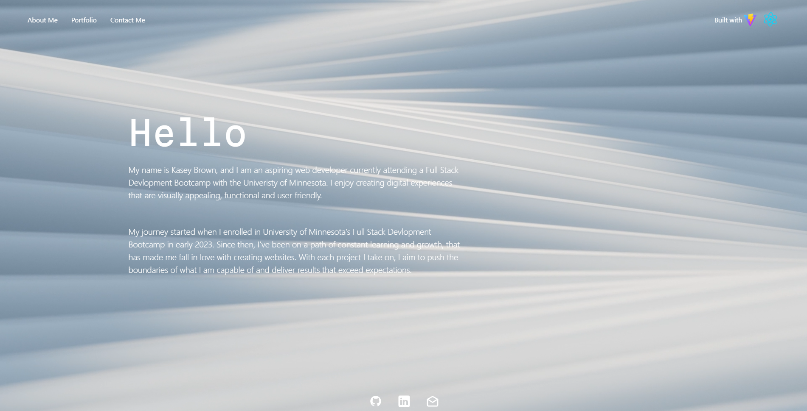

# ReactPortfolio

## Description

My React Portfolio!

## Table of Contents

- [Installation](#installation)
- [Usage](#usage)
- [Credits](#credits)
- [License](#license)
- [Author](#author)

## Installation

Go to the website:

## Usage

Go to the website:

## Credits

WebDevSimplified:

Tutorial helped me use an env variable with Vite.

https://www.youtube.com/shorts/r92aHr752Bg

ChaooCharles:

Tutorial helped me use email.js to set up contact me form without back-end.

https://www.youtube.com/watch?v=bMq2riFCF90&t=610s

Dani Krossing:

Tutorial helped me better understand how to make my website responsive.

https://www.youtube.com/watch?v=UUjNEMXZA-k&t=372s

Code Commerce:

Tutorial helped me make a video as my website background.

https://www.youtube.com/watch?v=LSRNmhLS76o&t=326s

Rostislav Uzunov:

Used his video as website background.

https://www.pexels.com/video/close-up-video-of-a-wavy-plastic-9150545/

## Author

email: kaseyabrown28@gmail.com

github: https://github.com/brownKasey

## License

This project is using the Mit License.
